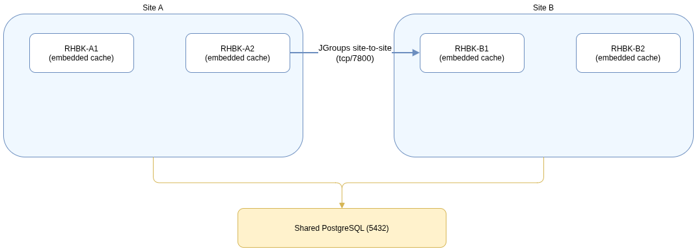
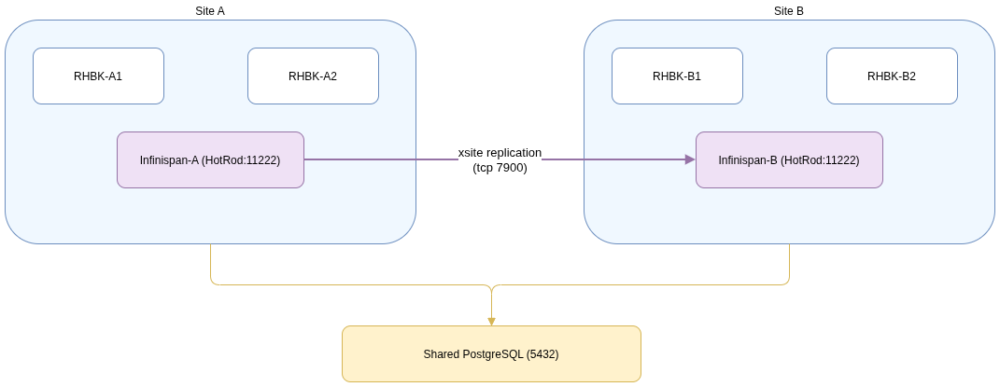

# **Firewall & Network Requirements for RHBK Multi-Site Deployments**
##### (v26.2/v26.6 Production-Hardened Guide)

This document details the **network and firewall ports** required for the Red Hat Build of Keycloak multi-site workshop. It maps port allocations across both deployment models (Path A and Path B) to ensure strict, secure-by-default VM environment topologies under RHEL 9.

---

## **Quick Topology Summary**

*   **Site A:** 2x Keycloak VM Nodes (`sso-1-a`, `sso-2-a`), 1x HAProxy VM Node (`sso-lb-a`), and (for Path B) standalone Infinispan nodes.
*   **Site B:** 2x Keycloak VM Nodes (`sso-1-b`, `sso-2-b`), 1x HAProxy VM Node (`sso-lb-b`), and (for Path B) standalone Infinispan nodes.
*   **Site Zero (Shared Infrastructure):** 1x Authoritative BIND DNS / Global HAProxy VM Node (`sso-gslb`), 1x Shared PostgreSQL VM Node (`db-host`), and 1x Monitoring & Logging VM Node (`sso-mon`).

---

## **Firewall Matrix (High-Level)**

| Source Component | Destination Component | Purpose / Protocol | Standard Ports | Direction |
| :--- | :--- | :--- | :--- | :--- |
| **Browser / Client** | Global HAProxy (`sso-gslb`) | Public HTTPS Entrypoint | `443` (TCP) | Incoming |
| **Global HAProxy** | Site HAProxy (`sso-lb-a/b`) | Dynamic Routing Delivery | `443` (TCP) | Outgoing to LBs |
| **Site HAProxy** | Keycloak JVM Nodes | Backend HTTPS Delivery | `443` (TCP) | Outgoing to Nodes |
| **Keycloak Nodes** | PostgreSQL DB | Database Connections | `5432` (TCP) | Outgoing to DB |
| **Prometheus Monitor** | All Workshop Targets | Metrics Scraping / Pull | `9000` (Keycloak), `11222/11223` (Infinispan), `9090` (HAProxy Stats) | Outgoing to Nodes |
| **Keycloak Site A (Path A)** | Keycloak Site B (Path A) | Cross-Site WAN JGroups `RELAY2` | `7800` (TCP) | Bidirectional |
| **Keycloak Nodes (Path B)** | Infinispan Containers | Remote Caching Hot Rod Client | `11222` (Site A), `11223` (Site B) | Outgoing to Cache |
| **Infinispan Site A (Path B)**| Infinispan Site B (Path B) | Cross-Site WAN JGroups `RELAY2` | `7800` (TCP) | Bidirectional |

---

## **Path A: Native Embedded Cache Firewall Requirements**



### **Behavior**
*   Infinispan runs coupled inside each Keycloak JVM process.
*   Nodes within a datacenter discover each other using a database registry via **`JDBC_PING`**.
*   Nodes communicate across sites directly via **JGroups `RELAY2`** TCP channels on port `7800`.

### **Relevant `keycloak.conf` Properties (Site A Example):**
```properties
cache=ispn
cache-config-file=cache-ispn-xsite.xml
spi-cache-embedded-default-site-name=site-a
spi-cache-embedded-default-site-name-backup=site-b
```

### **Ports to Open on Keycloak VM Nodes (Path A):**
*   `7800/tcp` - JGroups intra-site clustering and inter-site cross-site WAN replication.
*   `9000/tcp` - Keycloak management port (exposes Prometheus metrics and local readiness health checks).

### **Example `firewalld` Rules for Path A Nodes:**
```bash
# Allow local JGroups transport and cross-site replication
sudo firewall-cmd --permanent --add-port=7800/tcp

# Allow prometheus metrics scrape and local HAProxy health checking
sudo firewall-cmd --permanent --add-port=9000/tcp

# Apply changes
sudo firewall-cmd --reload
```

---

## **Path B: Standalone External Decoupled Cache Firewall Requirements**



### **Behavior**
*   Keycloak instances run as stateless clients, making remote **Hot Rod** connection calls to the local external Infinispan container on port `11222`/`11223`.
*   Stand-alone Infinispan containers cluster locally and replication over the WAN link is offloaded entirely to the Infinispan tier using JGroups `RELAY2` on port `7800`.

### **Relevant `keycloak.conf` Properties (Site A Example):**
```properties
cache-stack=tcp
cache-remote-host=sso-mon.mydomain.com
cache-remote-port=11222
cache-remote-tls-enabled=false
```

### **Ports to Open on Standalone Infinispan Hosts (Path B):**
*   `11222/tcp` - Site A Hot Rod endpoint connection port.
*   `11223/tcp` - Site B Hot Rod endpoint connection port (mapped on shared hosts to avoid interface conflicts).
*   `7800/tcp` - JGroups cross-site WAN replication traffic.
*   `7900/tcp` - JGroups internal state transfer synchronization port.

### **Example `firewalld` Rules for Standalone Infinispan Host VM:**
```bash
# Allow Hot Rod clients to write and query sessions
sudo firewall-cmd --permanent --add-port=11222/tcp
sudo firewall-cmd --permanent --add-port=11223/tcp

# Allow cross-site WAN replication and JGroups cluster traffic
sudo firewall-cmd --permanent --add-port=7800/tcp
sudo firewall-cmd --permanent --add-port=7900/tcp

# Apply changes
sudo firewall-cmd --reload
```

---

## **Shared Core Components Firewall Requirements**

Regardless of your chosen caching path, the following core infrastructural ports must be configured across the environment:

### **PostgreSQL Database Node (`db-host`):**
*   `5432/tcp` - Allow relational schema queries and connections from all Keycloak JVM hosts.
```bash
sudo firewall-cmd --permanent --add-port=5432/tcp
sudo firewall-cmd --reload
```

### **Site-Local Load Balancers (`sso-lb-a`, `sso-lb-b`):**
*   `443/tcp` - Allow incoming client HTTPS requests.
*   `9090/tcp` - Allow Prometheus to pull local HAProxy health metrics.
```bash
sudo firewall-cmd --permanent --add-port=443/tcp
sudo firewall-cmd --permanent --add-port=9090/tcp
sudo firewall-cmd --reload
```

---

## **Verification & Troubleshooting**

### **Check Active Open Port Mappings:**
```bash
sudo firewall-cmd --list-ports
```

### **Test Remote Network Reachability:**
Verify that socket connections can be established across VM boundaries using `nc` (netcat):
```bash
# Test PostgreSQL database connectivity from a Keycloak node
nc -zv db-host.mydomain.com 5432

# Test local Infinispan connection from a Keycloak node
nc -zv sso-mon.mydomain.com 11222

# Test WAN JGroups channel from Site A to Site B
nc -zv sso-1-b.mydomain.com 7800
```